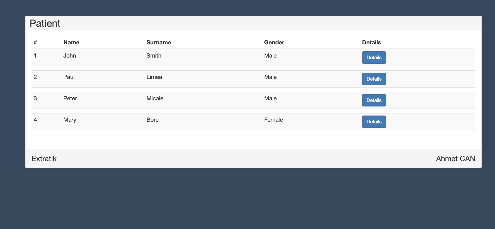
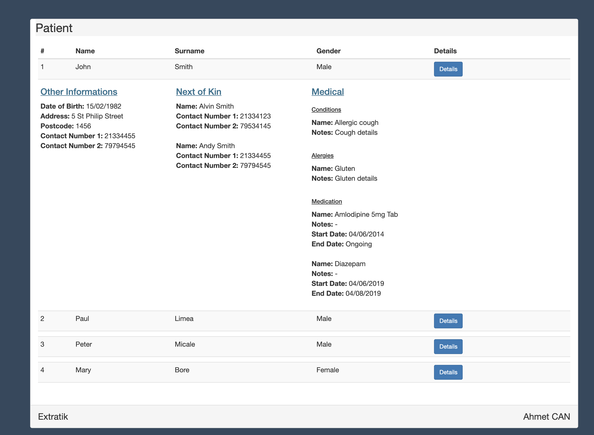

# Extratik Patient Case

## Aim
    Showing the data pulled from the given Json file with as few clicks as possible

## Run
- git clone https://github.com/cnahmetcn/extratik_patient_case.git
- composer install
- cp .env.example .env
- php artisan key:generate
- php artisan serve

## Images

 

